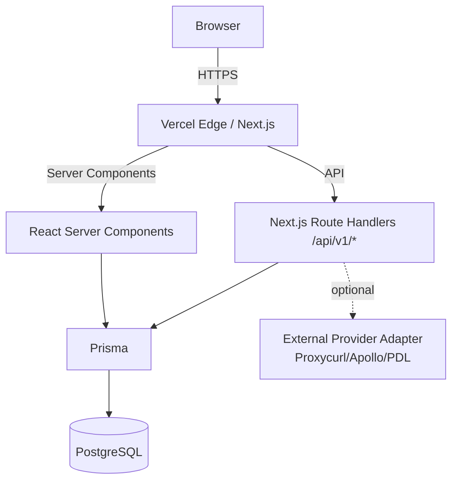
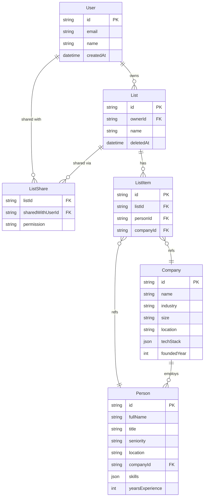

# Architecture

## High-level

A monorepo (pnpm workspaces + Turborepo) with one deployable app and a few shared packages.



## Monorepo layout

```
apps/
  web/                 Next.js 15 app (FE + API)
packages/
  ui/                  shadcn-based shared components
  db/                  Prisma client + schema (re-exported from apps/web)
  types/               shared Zod schemas + TS types (FE/BE share)
postman/               API contract / mock data source
docs/                  spec, design, tasks, status, demos
.claude/
  agents/              10 subagent definitions
  commands/            6 slash commands
  settings.json        hooks
scripts/               shell utilities
```

## Tech choices and why

| Concern | Choice | Why |
|---------|--------|-----|
| Runtime | Node 22 LTS | latest stable, native fetch, perf wins |
| Framework | Next.js 15 (App Router) | RSC, route handlers, Vercel-native |
| Lang | TypeScript strict | catch bugs at compile, refactor confidence |
| Lint/Format | Biome | ~10x faster than ESLint+Prettier, single tool |
| Styling | Tailwind + design tokens | constraint-based, no CSS sprawl |
| UI primitives | shadcn/ui + Radix | accessible defaults, headless flexibility |
| Forms | react-hook-form + Zod | shared validation FE/BE, perf, DX |
| ORM | Prisma | strong types, migrations, no raw SQL footguns |
| DB | PostgreSQL 16 | full-text + jsonb + scale path |
| Auth | Auth.js v5 (NextAuth) | OAuth + email + battle-tested |
| Search (MVP) | Postgres FTS + filters | one-system-less to operate |
| Search (later) | Meilisearch / Typesense | only if FTS becomes a bottleneck |
| Tests | Vitest + Playwright | Vitest for unit/integration, Playwright for e2e |
| Logger | pino | fast, structured, JSON-out |
| Pkg mgr | pnpm | workspaces, disk efficiency, strict |
| Build orchestrator | Turborepo | task pipeline, remote cache |
| CI | GitHub Actions | repo-native |
| Deploy | Vercel | Next.js-native, edge cache |

## Data model (high level)



## API contract

- All endpoints under `/api/v1/`
- List response: `{ data: T[], meta: { total, page, pageSize, hasMore } }`
- Single response: `{ data: T }`
- Error response: `{ error: { code: string, message: string, details?: object } }`
- Auth: cookie session (HttpOnly, SameSite=Lax)
- Rate limit (later): per-user/IP via Vercel edge middleware

The full surface area is documented in [postman/apollo-like.postman.json](../postman/apollo-like.postman.json), kept up-to-date by `backend-dev-1` and `backend-dev-2`.

## State management

- **Server state**: React Server Components fetch on the server. No client state lib needed for fetched data.
- **URL state**: filters, search query, pagination — all in `searchParams`. Back-button friendly.
- **Local UI state**: `useState` for component-local; React Context only for cross-cutting concerns (theme, current user).
- **No Redux/Zustand/Jotai unless we hit a wall** — the React 19 + RSC + URL state combo covers 90% of needs.

## Folder conventions inside `apps/web`

```
app/
  (routes)/
    page.tsx                home
    search/page.tsx
    people/[id]/page.tsx
    companies/[id]/page.tsx
    lists/page.tsx
    lists/[id]/page.tsx
    login/page.tsx
  api/
    auth/[...nextauth]/route.ts
    v1/
      people/route.ts
      people/[id]/route.ts
      companies/route.ts
      companies/[id]/route.ts
      me/route.ts
      lists/route.ts
      lists/[id]/route.ts
      lists/[id]/items/route.ts
      lists/[id]/share/route.ts
      exports/csv/route.ts
  layout.tsx
  loading.tsx
  error.tsx
  not-found.tsx
components/                  shared components (FE-2 territory)
lib/
  cn.ts                      clsx + tw-merge
  auth.ts                    Auth.js config
  prisma.ts                  Prisma client singleton
  search/filters.ts          query builder for search
  providers/                 external data adapters (Proxycurl, Apollo, etc.)
  i18n/                      string tables
__tests__/
e2e/                         Playwright specs
prisma/
  schema.prisma
  seed.ts
  migrations/
```

## Security

- Secrets only in `.env.local` (git-ignored) and Vercel env
- `NEXT_PUBLIC_*` for non-secret config only
- CSRF: Auth.js handles for cookie sessions; custom routes verify `Origin`
- SQL injection: Prisma parameterizes; no raw queries on user input
- XSS: React escapes by default; never use `dangerouslySetInnerHTML` on user content
- PII: never log full request bodies in production; structured fields only
- Rate limiting: post-MVP; Vercel edge middleware

## Performance budgets

- LCP < 2.5s on 4G
- CLS < 0.1
- p95 API search < 500ms locally
- Bundle: route-split, no `import *`
- Images via `next/image`, fonts via `next/font`

## Observability (post-MVP)

- pino structured logs to stdout (Vercel ingests)
- Error reporting via Sentry (free tier)
- Vercel Analytics for web vitals
- A simple `/api/healthz` for uptime
