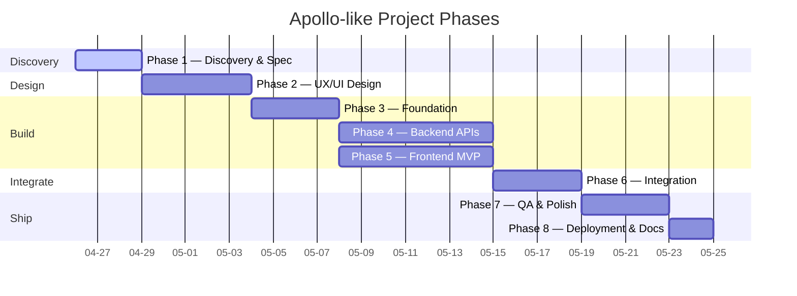
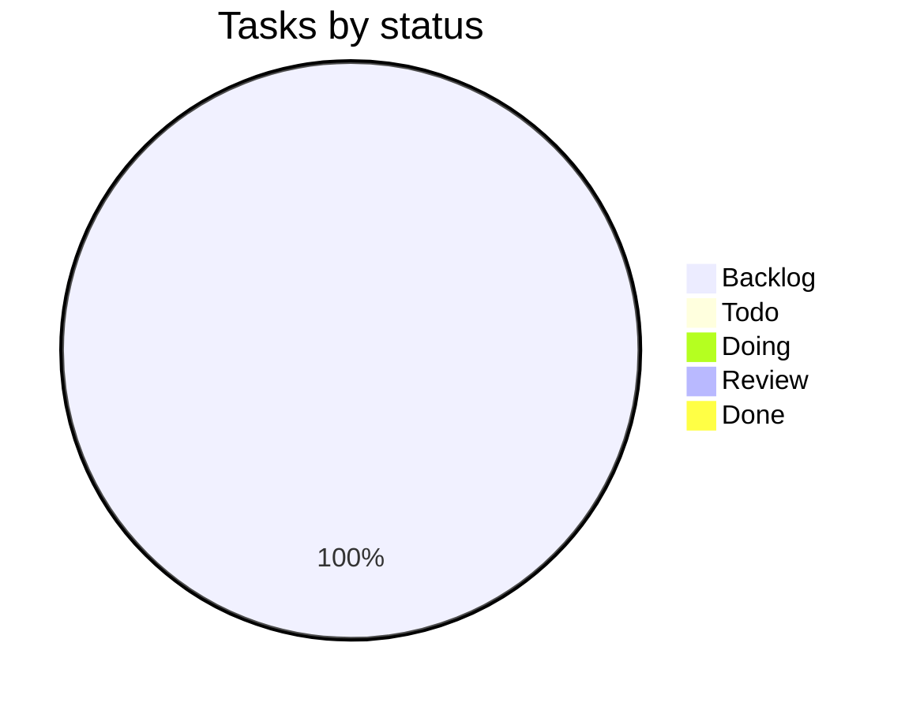
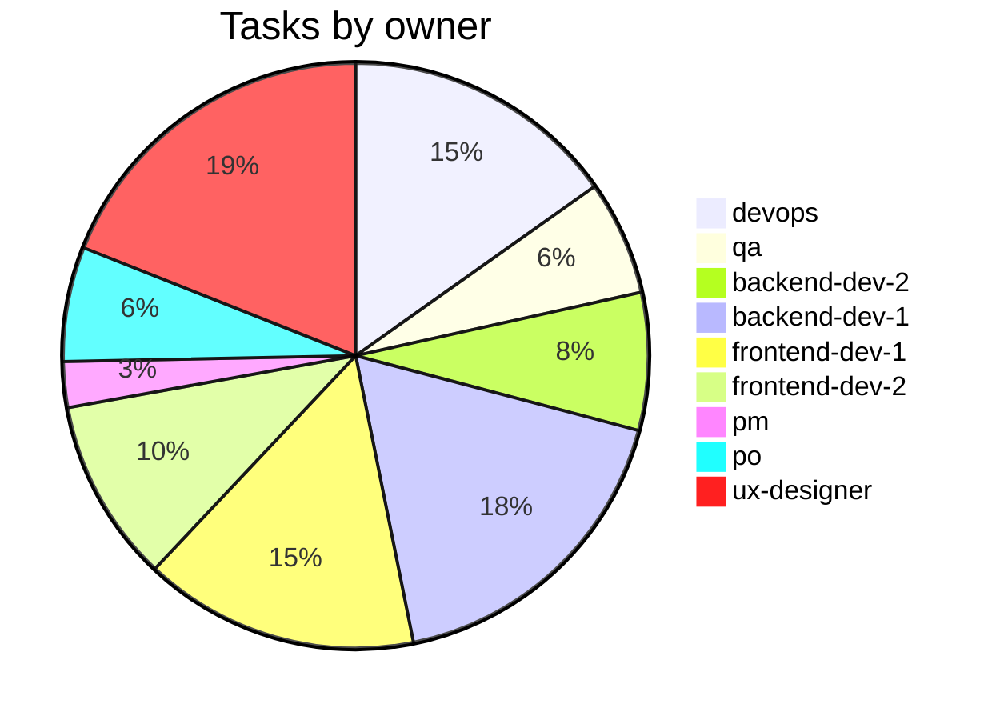

# Project Status

**Auto-generated** by `scripts/update-status.sh`. Do not edit by hand — your changes will be overwritten.

_Last updated: 2026-04-26_

---

## Phase Progress

| Phase | Name | Status | Tasks | Progress | Tag |
|-------|------|--------|-------|----------|-----|
| 1 | Discovery & Spec | active | 0/5 | 0% | _pending_ |
| 2 | UX/UI Design | pending | 0/15 | 0% | _pending_ |
| 3 | Foundation & Architecture | pending | 0/12 | 0% | _pending_ |
| 4 | Core Backend APIs | pending | 0/14 | 0% | _pending_ |
| 5 | Frontend MVP | pending | 0/13 | 0% | _pending_ |
| 6 | Integration | pending | 0/7 | 0% | _pending_ |
| 7 | QA & Polish | pending | 0/7 | 0% | _pending_ |
| 8 | Deployment & Docs | pending | 0/6 | 0% | _pending_ |

**Overall:** 0/79 tasks Done (0%)

---

## Gantt — phase timeline

> Phases 4 and 5 run **in parallel** after phase 3 completes.

---

## Kanban — task counts

---

## Workload — tasks by agent

---

## Current phase

**Phase 1 — Discovery & Spec**

See [tasks.md](tasks.md) for the live board, [PHASES.md](PHASES.md) for acceptance criteria.

---

## How to read this file

Tables and Mermaid charts above are regenerated from [tasks.md](tasks.md) on every save. For free-form daily notes, see [daily-reports/](daily-reports/). For per-phase demos, see [demos/](demos/).
